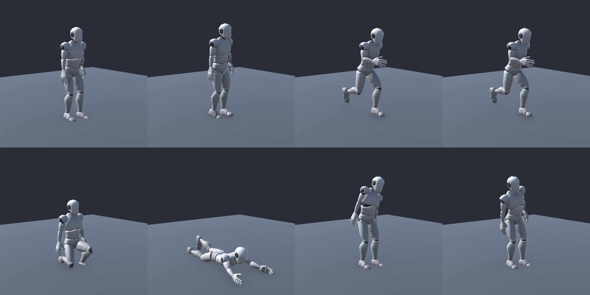

# Character animation integration

## Controls and ownership

WASD = slow walk (1.2), Alt + WASD = tactical movement (2.4), Shift + forward = full sprint (4.5). Crouch (C) moves at 0.65; prone (Z) at 0.3. Hold Q/E to lean left/right; both together cancel. Lean is allowed on the ground while standing/crouching, including tactical movement, but not sprinting, jumping, prone, or special actions. No extra stamina cost is applied for leaning.

Input remains bundled into MoveServerRpc. The server publishes movement mode and lean alongside existing posture/action/stamina variables. The Animator follows these values on every peer; root motion is disabled. The owner camera offsets/rolls locally with a wall probe. Lean does not move the gameplay capsule or create a separate hitbox system.

## Assets

- Animator-provided source: Assets/animtion_demo.fbx, SHA256 5F3CFF880570A3FC3994A4E0A8618E905891A76D14EF36E62710A0C49FE99B62. Exact match to demo animation.unitypackage supplied by the user.
- Dummy: https://kevdev.itch.io/human-character-dummy, Unity download, retrieved 2026-09-17. Original files are retained under Assets/Kevin Iglesias/Human Character Dummy. The masculine rig is the initial visual; the pack also includes the feminine rig.
- Generated gameplay assets: Assets/Animations/Player. These are separate from the original DemoAnimator and source FBX.
- Generation tool: Oskar Mike > Animation > Build Dummy Player Animations. Rebuilding resets generated clips/controller/material/prefab visual to this mapping; edit the tool for persistent mapping changes.
- The material uses URP/Lit. The player capsule remains physical; its old debug renderer is disabled.

## Clip mapping

| Gameplay | Source clip | Status |
|---|---|---|
| Standing idle | idle | Provided |
| Slow walk | walk | Provided |
| Tactical walk | run at 0.85x | Shared run clip |
| Full sprint | run at 1.2x | Shared run clip |
| Crouch entry / idle / movement | sit / idle_sit / walk_sti | Mapping inferred from source names; review pose |
| Prone entry / idle / crawl | Prone / idle_Prone / Prone_walk | Provided |
| Jump / falling | jump / jump_idle | Provided; falling is provisional |
| Lean left / right | Q / E | Held endpoint pose, additive upper-body mask |
| Slide | idle_sit | Temporary crouched pose |
| Dive | idle_Prone | Temporary prone pose |
| Vault | jump_idle | Temporary airborne pose |
| Backward / strafing | Corresponding forward locomotion | Temporary; no directional clips supplied |
| Standing up / landing | Crossfade into destination locomotion | Temporary; no dedicated clips supplied |

Animations do not determine speed, collision, stamina, or action duration. Foot sliding can remain until clip cadence and travel speed are tuned together. Entry clips currently blend briefly before entering posture locomotion. Replace placeholder motions on their named controller states, or update the generator for durable changes.

The owner body uses a LocalPlayerVisual layer excluded only by the owner camera, avoiding first-person head/body clipping. Observe the model using Unity Scene view during Play Mode or a second connected player. This is not a first-person arms/weapon rig.

## Verification checklist

- Restart MovementTest Play Mode; regeneration of the scene is unnecessary.
- Check idle, WASD walk, Alt run, Shift faster run and exhaustion fallback.
- Check C/C and Z/Z, posture entry and locomotion, camera restoration.
- Hold Q/E, release, hold both, and lean near a wall. Check crouched lean; confirm sprint/prone/air suppress lean.
- Space jumps or vaults; Shift+C slides, Shift+Z dives. Placeholder poses must not affect action displacement or stamina costs.
- Inspect foot contact, body orientation, Q/E direction, and ground penetration on the retargeted dummy.
- On a remote client, confirm movement/posture/lean animation and owner-only camera/HUD.
- Recheck MainMenu -> Lobby -> GameMap, four-player spawning, and host departure.

Original FBX import reports discarded nonstandard bone translation/scale channels during Humanoid conversion. A valid avatar and successful build do not establish final animation quality; review the retargeted motion visually with the animator.

## Captured pose preview

Top row: idle, walk, tactical run, full sprint. Bottom row: crouch idle, prone idle, lean left, lean right. This is a static pose sample, not proof of smooth transitions or remote synchronization.

## Validation performed on 2026-09-17

Unity 6000.3.9f1 imported and compiled the integration successfully. The local-host Play Mode smoke check passed nine stages: idle, slow walk, tactical run, full sprint with stamina drain, lean left, lean right, lean release, crouch with lean, and prone with lean suppressed. Sprint also suppressed lean. Assertions checked a valid Humanoid avatar, root motion disabled, the two animation layers, owner-camera body masking, and lowered head position during crouched lean/prone.

The smoke check supplies deterministic input to the existing movement RPC; it does not simulate physical keyboard events or a remote network client. Static retargeted pose rendering was inspected separately. Remote-client sync, four-player flow, camera-wall behavior during live movement, animation cadence/foot sliding, and complete special-action transitions still require hands-on testing. The source import's discarded translation/scale warnings remain a visual-quality consideration.
